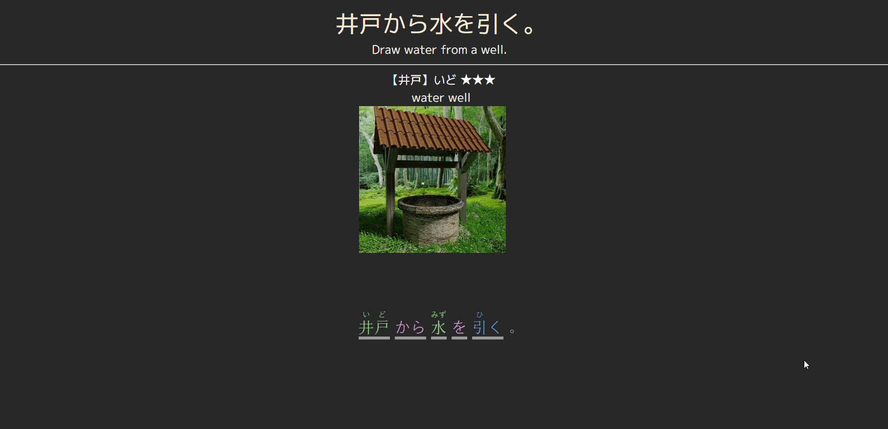

# Japanese Sentencer Gloss Utility For Anki

# How To Use

Add the following line to your note:

`<embed src=https://cademcniven.github.io/gloss.html?query={{sentence}} style="width: 100%; height:100%; min-height: 350px;  ">`

replace `{{sentence}}` with whatever your field is called. Also feel free to adjust the height and width if you experience any issues with that.

# Changing Background Color

You can also change the background color to match the style of your card. To do this, you'll need to add `&color=` to your embed src like so:

`<embed src=https://cademcniven.github.io/gloss.html?query={{sentence}}&color=white style="width: 100%; height:100%; min-height: 350px;  ">`

**Note:** hex color values are **not** supported. You either need to specify an web-compliant color name, or convert your hex to rgb like this:

`<embed src=https://cademcniven.github.io/gloss.html?query={{sentence}}&color=rgb(12,34,56) style="width: 100%; height:100%; min-height: 350px;  ">`

# Issues

This is very much a WIP so don't expect it to be perfect, but I think even as it currently is it's very usable. I'll continue working on it in the future which might fix things, or might make them worse, idk.

As with any other auto-generated info, don't blindly trust the furigana -- it's often correct, but not perfect. Also, the tokenization (that is, how it chooses to break up words) is decent but also not perfect, and there's not much I can do about that.

Feel free to let me know if you notice any serious issues and I'll try to fix it.

# Sources
This project is a fork of [Rikaibun](https://github.com/DeadlyFugu/Rikaibun) that's been modded to embed nicely into anki.

# License
All code written by me in this project is under the zlib license.
kuromoji.js is provided under it's own license.
The files jmdict_dump.js and jmdict_meanings.js are derived from the JMdict dictionary file in accordance with the Electronic Dictionary Research and Development Group's license.
The file kanjidic2.js is similarly derived from the kanjidic2 dictionary file in accordance with the Electronic Dictionary Research and Development Group's license.
